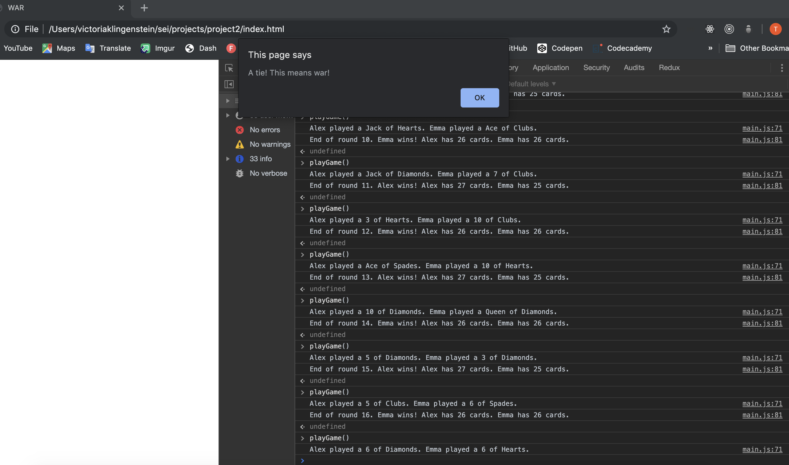

# -> Game of War <-
## -> Project 2 <-

## -> Goal <-
### The goal of this project was to create a program that would run in the console and simulate the classic card game "War".

## -> Languages <-
### This game is built primarily in JavaScript with some html to allow the user to see the game in the browser console. 

## -> Download <-
### To download this game, fork and clone this repository. Open the index.html file in your browser. Open the browser console and follow instructions to play the game!

## -> Challenges <-
### The biggest challenge here was breaking the game down into lots of tiny functions and making sure that they worked together properly. 

### Figuring out how to shuffle the deck randomly was also a challenge. After playing around with it on my own, I ended up finding a shuffling function online that I could insert easily.

### For a while, I was having a hard time figuring out how to access the players' cards so that each round a message could show exactly which cards were played. My classmate Bola suggested I make a separate function to identify the cards played instead of trying to identify them in the compareCards function. Problem solved!

### On rare occasions during test runs, the game would go on into the hundreds of thousands of rounds. This caused the console to stall. I had to set a round limit of 2000 rounds. 

### I wonder about the sequence of the program. In several places the code needs to run in order. For example, the drawn cards need to be identified by the whatCard function before being pushed to the winner's deck.In this game, JavaScript ran the functions in the correct order, so I didn't bother to reconstruct my functions. But I wonder if it could cause an error in the future.

## -> Next Steps <-
### Someday, I'd like to add a visual component to the game, so that it runs in the browser instead of the console. I want to look for ways to streamline my code and ensure that all functions will always run in the correct order. 

