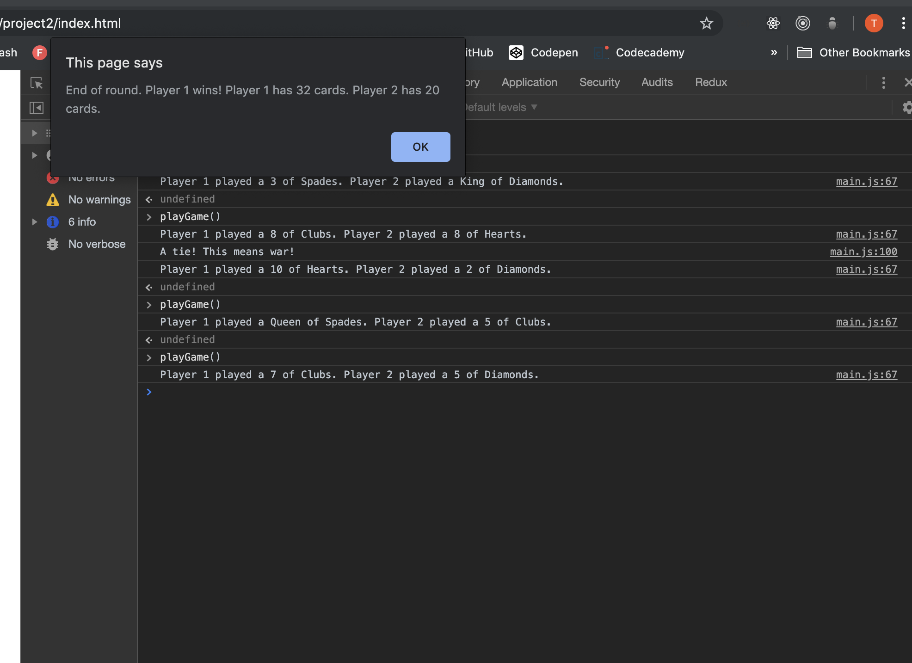

# Game of War
## Project 2

## Goal
### The goal of this project was to create a program that would run in the console and simulate the classic card game "War".

## Languages
### This game is built primarily in JavaScript with some html to allow the user to see the game in the browser console. 

## Challenges
### none!!!  i got this!!

## Download
### To download this game, fork and clone this repository. Open the index.html file in your browser. Open the browser console and follow instructions to play the game. 
